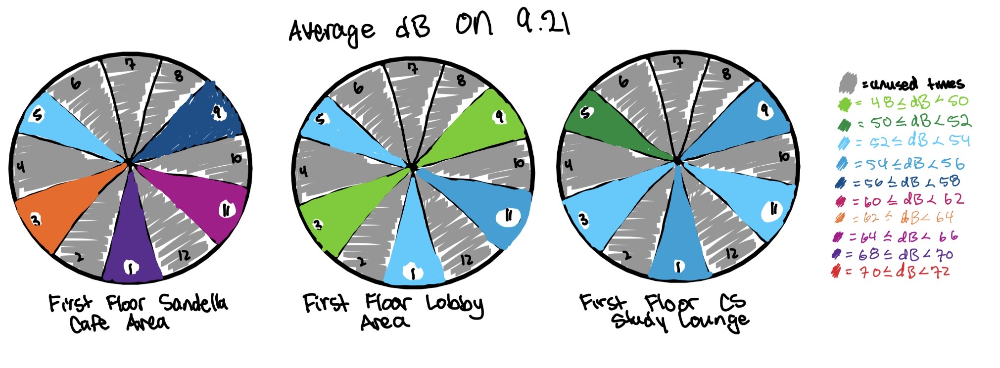
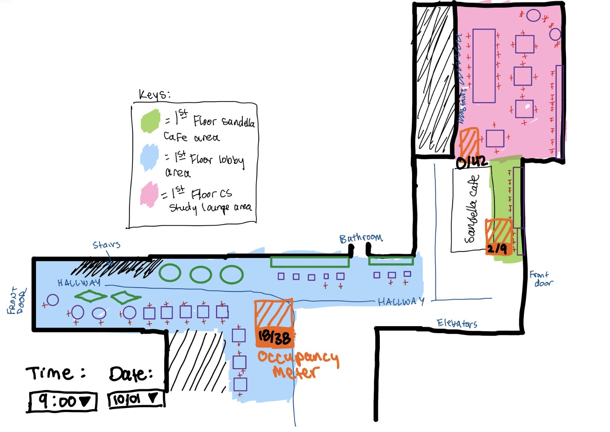
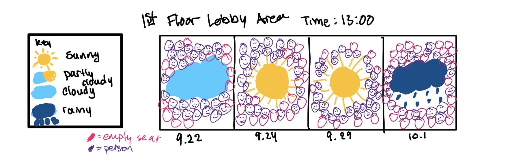
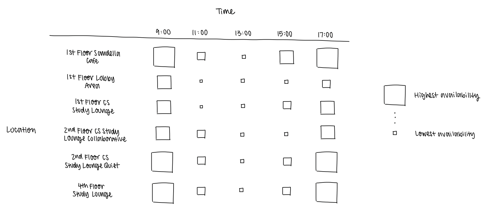
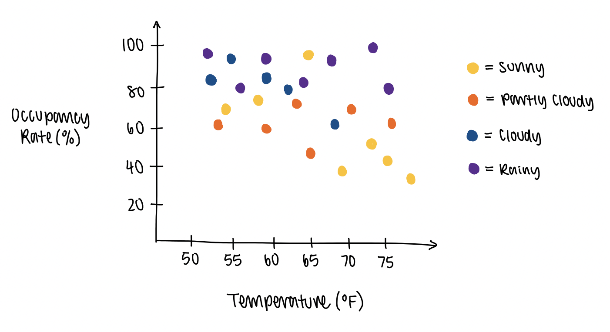
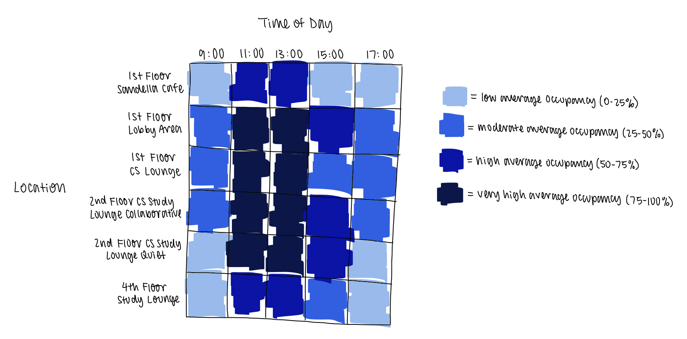
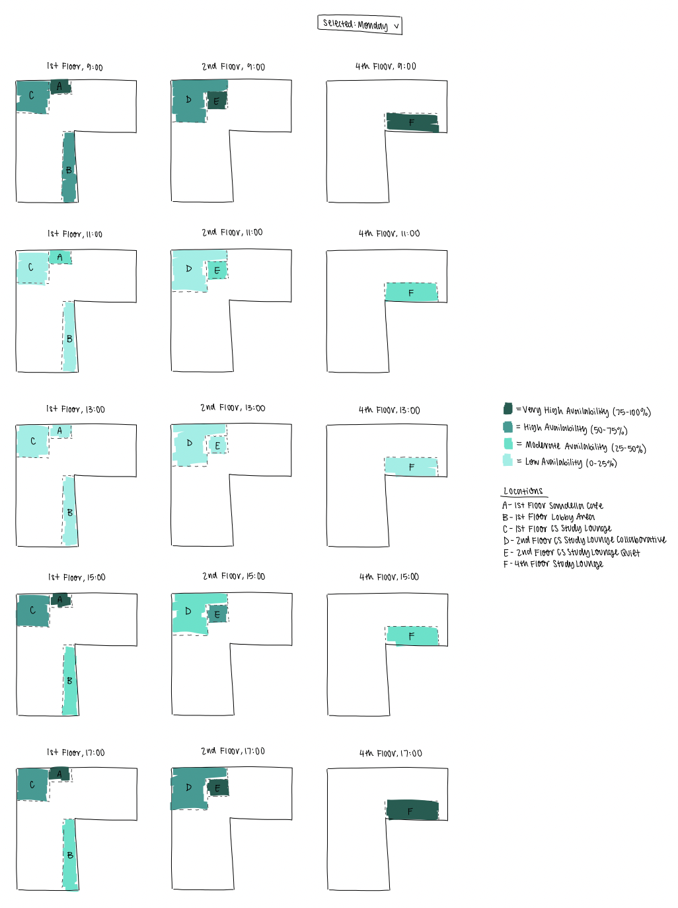

<!-- # for main headers, ** for bold text, - or * for bullet points, and | for tables
 -->

# Task #1: Observation and data collection plan

## Primary Dataset
- Add path to CSV file
- 

## Description of What is Desired to Observe and Why
- Our group desires to observe the University of Illinois-Chicago's (UIC) Computer Design and Learning Resource Center (CDLRC). We want to observe the enviornment of different selected locations of study spots around the building across multiple times and days.
- Just like many Computer Science (CS) students at UIC, we study in the CDLRC frequently and are curious as to what constitutes optimal study spots in that building, meaning that the enviornment can support the productivity of our academics and work.

## Four Initial Domain Questions
- Around a certain time, where are the most available spaces to study in the CDRLC?
- Which spaces in the CDRLC provide the studying quality I want?
- What ammenities are near these study locations in the CDRLC?
- Which study spaces best fit different study activites in the CDRLC?

## Proposed Data Collection Process

An observation is constituted as a visit to a study spot location, where we will record the attributes that we've listed in our data dictionary below. We want to take into
account those observations because enviornmental factors and what different spaces have to offer are inherent factors that cause people to
subconciously decide where they want to study. Admittedly, our list of attributes is very granular because it's not feasible for us to fully
anticipate or know how the actual data collection experience will go and what our findings will be, so we want to cover as many attributes as
we can per observation for now. We will make adjustments based on the outcomes later, if necessary.

Since our focus is on the CDRLC, all of the locations that we will visit will be in this building only. We've also identified 14 locations
to collect data, and these locations are a mix of main or prominent study areas and smaller study spots that are in different corners of the
building. We plan on collecting data at every hour of the weekday (Monday to Friday) starting from 9 AM and ending at 6 PM, which are the most
common times that students are in the building. The plan is to collect data across five days. Repeating observations by visiting many locations
for each hour of the timeframe we described will ensure that our data captures meaningful variation about each study spot rather than a single
snapshot. For instance, the situation of study spots on Monday at 12 PM would most likely be different than the situation on Friday at 5 PM.

In terms of dividing the work of data collection, our group of two members will split the work based on our schedule availability at different
hours of the day. This ensures that at least one person is available to collect data at a particular time. Something else we've considered is the
difficulty of having one person collect data at, for instance, 9 AM every day because the contraints of our schedules don't allow
for that. One member might be available at 9 AM on Tuesday's and Thursday's only, so the other person would fill in for the other three days since
they're available at that time on those days. Despite these circumstances, the group addressed them by collectively discussing our data collection
methodology to ensure we're all on the same page and to minimize as much inconsistencies and human error as possible. Some ways we ensure that our
data collection process is the same is that we both use the same weather app and noise level recording app, we both record noise levels for exactly
30 seconds and focus on recording the mean or average decibel value, and we have discussed how to count open vs. occupied seats or what constitutes
particular chair or table types.

Our collection process might introduce bias based on what we determine to be a group of students that are together, our personal definitions of tables
or chairs, the tables and chairs getting moved around, and possibly miscounting people due to the natural movement of people leaving and entering an
area or people standing instead of sitting.

## Initial Data Dictionary
| Attribute                           | Type         | Description                                                   | Example                   |
| :--- | :--- | :--- | :--- |
| `date`                              | Temporal     | Date of observation                                           | 9/17/2026                 |
| `time`                              | Temporal     | Time of observation                                           | 13:00                     |
| `location`                          | Categorical  | Location of the study area                                    | 2nd Floor CS Study Lounge |
| `weather_condition`                 | Categorical  | Description of the outside weather                            | Sunny                     |
| `weather_temperature`               | Quantitative | Degree in Fahrenheit                                          | 75                        |
| `noise_level`                       | Quantitative | Average noise level in decibels across the span of 30 seconds | 81.2                      |
| `occupancy`                         | Quantitative | Total number of occupants at a location                       | 15                        |
| `single-person_tables`              | Quantitative | Number of fully open tables for 1                             | 6                         |
| `two-person_tables`                 | Quantitative | Number of fully open tables for 2                             | 3                         |
| `tables_for_multiple_people`        | Quantitative | Number of fully open tables for 3+ people                     | 5                         |
| `nook_chair_availability`           | Quantitative | Number of open nook seats                                     | 4                         |
| `regular_plastic_chair_availability`| Quantitative | Number of open regular pastlic seats                          | 8                         |
| `tall_plastic_chair_availability`   | Quantitative | Number of open tall plastic seats                             | 3                         |
| `sofa_spot_availability`            | Quantitative | Number of empty soft seats                                    | 1                         |
| `outlets`                           | Quantitative | Number of outlets at a location                               | 4                         |
| `window_access`                     | Categorical  | Is there access to direct sunlight?                           | Yes                       |
| `number_of_single-person_tables`    | Quantitative | Number of tables for 1 at a location                          | 5                         |
| `number_of_two-person_tables`       | Quantitative | Number of tables for 2 at a location                          | 4                         |
| `number_of_multiple_people_tables`  | Qunatitative | Number of tables for 3+ people at a location                  | 4                         |
| `number_of_nook_chairs`             | Quantitative | Number of nook seats at a location                            | 7                         |
| `number_of_regular_plastic_chairs`  | Quantitative | Number of regular plastic chairs at a location                | 4                         |
| `number_of_tall_plastic_chairs`     | Quantitative | Number of tall plastic chairs at a location                   | 8                         |
| `number_of_sofa_spots`              | Quantitative | Number of sofa spots at a location                            | 2                         |                                      

# Task 2: Pilot and data collection

## Pilot Collection & Key Findings
On September 17, 2026 at 11:00 AM, our team conducted a pilot collection at the University of Illinois-Chicago (UIC) Computer Design Research and Learning Center (CDRLC)

## Collection Protocol & Timing
To test workload and feasibility of the collection, the team split up and each collected data across the different floors:
- Elizabeth: Covered all designated study spots on Floors 1 and 2 (time: ~20 minutes)  
  > *note: due to class time conflict Elizabeth did not cover all study spots*
- Michelle: Covered all designated study spots on Floors 1-5 (time: ~30 minutes) and tested a subset excluding Floors 3 and 5 (times: ~15 minutes)

At first, we recorded data using Google Sheets with a separate key mapping `Location ID` to `Location Description` (e.g., `11` for `Area in front of stairs`).

## Pilot Observations & Issues Found
- Location ID Issue: Needing to cross-reference `Location ID` numbers with the `Location Descriptions` caused extra unnecessary mental load and slowed down the collection process. 
- Enclosed Study Rooms: Initially, we planned to include the study rooms on the second floor that can be booked. However, these spaces are enclosed and pre-booking is required.
These rooms are already intended to provide private and quiet spaces to study, which don't add much value to our project since we're more interested in open or shared study spaces
that tend to have more environmental variations to them throughout different days and times.
- Office Hour Study Spaces: Initially, we also planned to factor in all of the Office Hour areas on the second floor. Due to time constraints and the fact that Office Hour spaces are
meant for students to get help from Teaching Assistants rather than be designated areas for studying, we decided that they do not align with our focus on general open/shared study spaces.
- Movable Furniture: Students frequently move chairs amongst tables, and they sometimes move them outside of designated rooms or spaces. Those phenomenon make it challenging to
track exact chair counts, providing unncessary complications to our data collection process.
- Seating Types: We initially wanted to track detailed chair/table variations (e.g., 1-person tables, nook chairs, tall plastic chairs, sofa spots, etc.). However, capturing these granular seating types proved overly complex, time-consuming, and difficult to standardize across collectors.

## Revisions & Professor Consultation

Following our pilot, we scheduled a meeting with our professor to discuss issues that arose, how to simplify our attributes without losing data, and more. 

During our meeting, our professor provided key feedback to guide our strategy:
- Increase Data Points: 30 observations isn't enough to capture meaningful variation. We need to collect across more days or more times throughout the day to notice if there’s any signal or pattern across the span of 1-2 days.
- Simplify Attributes: Shorten the total amount of attributes to make the process of frequently collecting observations more feasible. Our professor recommended using the simplest approach possible and to not worry about people moving between rooms or furniture moving around.
- Summarize Metrics: Summarize attributes after occupancy down to 2-3 essential, less granular attributes: count number of people, count the number of open seats, and count the number of outlets.

Based on our pilot findings and feedback from our professor, we made the following revisions:
- Removed study rooms and office hour study areas: Excluded booked study rooms and course-specific office hour tables to focus strictly on open/shared spaces.
- Simplified seating and furniture: Stripped away complex chair types and table variations in favor of simpler counts: seat availability and people present.
- Made study area zones bigger by merging nearby study areas: Combined adjacent areas where furniture easily moves around into unified zones so that individual chair shifts won't affect 
our counts unless the chairs are removed from those areas entirely.
- Replaced location ID system: Used direct location descriptions on the main collection sheet instead of forcing cross-referencing with a separate lookup key.
- Removed floors 3 and 5: Excluded these floors because they only consist of a single table with 2-3 seats next to the elevator, which did not provide useful data for our study.
- Expanded collection frequency: Scheduled data collection across multiple days and varying times of day to ensure we collect a higher volume of data points and detect meaningful patterns.

## Revised Data Dictionary (Post-Pilot)
| Attribute | Type | Description | Example |
| :--- | :--- | :--- | :--- |
| `date` | Temporal | Date of observation | 9/17/2026 |
| `time` | Temporal | Time of observation | 13:00 |
| `location` | Categorical | Specific study area within UIC CDRLC | 2nd Floor CS Study Lounge Collaborative |
| `weather_condition` | Categorical | Description of outside weather | Sunny |
| `weather_temperature` | Quantitative | Degree in Fahrenheit | 75 |
| `noise_level` | Quantitative | Average noise level in decibels across the span of 30 seconds | 81.2 |
| `occupancy` | Quantitative | Total number of occupants at a location | 25 |
| `open_seats` | Quantitative | Number of open seats at a location | 12 |

## Full Data Collection Strategy
- Collection Strategy: To increase data points as suggested by our professor, data will be collected over more days and more times throughout the day to notice if there's any signal or pattern across the span of 1-2 days.
- Dataset File:[File Path] (./Data/Pilot_Collection_Data.csv)

# Task 3: Data Description and Domain Questions

## Dataset Overview & Collection Process

Data was collected over a two-week period from September 21, 2026 to October 2, 2026 (Monday's to Friday's only). The data we collected captures spatial and temporal variations in noise and seating occupancy across six selected areas of CDRLC. The areas include the Sandella Cafe seating, 1st floor lobby area, 1st floor CS study lounge, 2nd floor CS study lounge (split into collaborative and quiet sections), and 4th floor balcony area. Sampling occurred daily across five fixed time slots (9:00 AM, 11:00 AM, 1:00 PM, 3:00 PM, and 5:00 PM). In total 50 observation windows and 300 individual area data points.

For every date, location, and time, we recorded these attributes: weather condition, temperature (°F), average noise level (dB), number of people, and number of open seats. Sound levels were caputured using 30-second average decibel readings with the Decibel X app, while ambient weather parameters were recorded with Apple's weather app.

To ensure consistent data collection, we established observational rules: chairs occupied by belongings were marked as occupied unless the owner was actively seated nearby, circle blue couches were recorded at a capacity of one person per circle, and long blue couches were evaluated at two people per stitched seat segment.

## Limitations and Biases

Our dataset contains inherent sampling limitations and potential sources of bias:
- Decibel Measurements: Capturing sound over a 30-second window means that even a brief burst of loud noise (e.g., someone dropping something, door closing, laughing loudly) could slightly skew the mean reading compared to ambient continuous volume. 
  > *Note this was attempted to be lowered by restarting recording if the noise subjectively really ruined the data*
- Seating Assumptions: deciding whether unattended bags represented a temporarily open seat or a long-term open spot. This requires subjective judgment but was attempted to limit based on obvious factors like an open laptop, or items on the table. (e.g., one person would typically not have 2 backpacks or 2 laptops)
- Temporal scope: Collection was constrained to weekdays between 9:00 AM to 5:00PM, our data reflects peak academic hours, but misses evening study habits and weekend activity.
  > *Note this was due to group members conflict with school schedules, work schedules, living off campus, etc*

## Abstraction & Process Reflection

Taking the dynamic physical spaces into rows and numeric values required compressing complex social environments into standardized attributes. Our dataset effectively captures quantitative trends for space usage, number of people, noise level, and outside weather conditions and temperatures.

Some qualitative nuances were lost in the abstraction:
- Noise Quality: decibel metrics capture sound pressure level but loses the type of noise a room has. For example, some rooms had a higher sound pressure level, but it was due to the loud HVAC in the room rather than human conversation.
- Seating Dynamics: Recording people count and open seats count fails to capture group dynamics like people working together or alone. It also fails to capture what types of seating are available. If a table with four chairs only has one person sitting compared to a table with four chairs and no one sitting.

Deciding how real-world observations became data points required creating a standard. For example, when individuals were standing we recorded them in people count and added in notes saying that they were standing so the open seats count baseline was not too affected. Also, having set couch capacity based on stitching helped us have discrete numeric attributes.

## Refined Domain Questions

1. Refined Question: Which study spaces are best suited for focused, distraction-free studying?
    - Original Quetion: Which spaces in the CDRLC provide the studying quality I want?
    - Reasoning: We changed the question so that it dives deeper into what it means to have a quality study space. We were inspired by noise levels and occupancy because the degree of those are potential indicators of how well an area is for studying.
2. Refined Question: Which locations in the CDRLC are the most reliable for finding open seating?
    - Original Question: Around a certain time, where are the most available spaces to study in the CDRLC?
    - Reasoning: We're still staying on the topic of finding available seating, but we modified it to put more intentionality on discovering where students can place their hopes on finding a place to study without dealing with the frustration of going to a spot and having to leave immediately due to limited seat availability. We would most likely utilize open seat metrics across
    different times, days, and locations to explore this question.
3. Refined Question: Does the demand or usage of study spaces change during poor outdoor conditions?
    - Original Quetion: What amenities are near these study locations in the CDRLC?
    - Reasoning: We changed our question because after reflecting on our pilot, we decided to not consider amenities. However, we did factor in weather conditions and temperature, and we're
    curious as to how attributes like poor weather condition and temperature impact the behavior of occupants, such as the utilization of study areas and seat availability.
4. Refined Question: How does the popularity of different study spaces change?
    - Original Quetion: Which study spaces best fit different study activities in the CDRLC?
    - Reasoning: We changed the original question to a more interesting one after we collcted data because the new one is more insightful and focuses on the intersection of occupancy across various times and different locations.

# Task 4: Task Abstractions
Abstract task 1: Identify locations that exhibit attributes associated with focused, distraction-free studying.
The action is to identify, and the targets are multiple attributes. I mapped the task this way because the goal is to identify study space locations
based on multiple attributes (like noise level and occupancy) rather than a single attribute. Multiple attributes help constitute the degree to which
a location is focused and distraction-free for students.

Abstract task 2: Compare the distribution of seating availability across locations.
The action is to compare, and the target is one attribute (with a focus on distribution). This task is mapped this way because the goal is to evaluate how seating 
availability (the attribute to focus on) varies across locations. By comparing distributions, both the overall availability and consistency of seats are revealed, which
help users determine which locations are the most reliable for finding open seating.

Abstract task 3: Compare study space usage across different outdoor conditions.
The action is to compare, and the targets are multiple attributes (with a focus on dependency and correlation). I mapped the task this way because it involves
comparing multiple attributes (like weather condition and temperature) with study space usage. The goal is to determine whether changes in outdoor conditions are
associated with changes in study space usage, helping users determine if there are any correlations.

Abstract task 4: Identify peak usage periods for different study spaces.
The action is to identify, and the target is on trends. This task is mapped this way because its goal is to examine how study space usage changes over time
and determine when usage reaches its highest levels. Trends is the most appropriate target because the task focuses on patterns and changes over time.

Mapping domain questions to abstract tasks has reshaped our thinking by revealing what users are actually seeking in our project's visualizations. This abstraction step
has also shifted our perspective for eventually evaluating the visualizations that may be most suitable for answering our domain questions. This is crucial since not all
visualizations answer questions the same way. Some are better suited than others, depending on the question. We haven't necessarily settled on particular visualizations at this
point, but this step will help us consider what constitutes appropriate visualizations that meet what users are hoping to learn from our data.

# Task 5: Visualization sketches
## Sketch 1 - Michelle

* **Main Idea:** 
  - This sketch uses a circular radial "clock" diagram to represent the daily schedule across the five time slots. It is split like a pie chart and colored based on noise level.

* **Domain Question Addressed:**
  - Focuses on: "Which study spaces are best suited for focused, distraction-free studying?"

* **Attributes Represented:**
  - Time (9 AM, 11 AM, 1 PM, 3 PM, 5PM)
  - Area Name
  - Average Noise Level (dB)

* **Marks & Visual Channels:**
  - **Marks:** Circles and Sector Arcs
  - **Channels:** Angles with names separate times of the day and colors show the noise level.

* **Reflection:**
  - This captures cyclic daily noise levels in areas at a glance, making it easy to see with the colors. It easily shows an area being on the quieter side because the colors remain similar.
  - This contains hours of data not collected which wastes space. This can only have one circle per day per space so it is not efficient.

* **Differentiation:** 
  - This differs from horizontal line graphs by being similar to something people are used to looking at, a clock, and using color to visual noise levels.

## Sketch 2 - Michelle

* **Main Idea:** 
  -  This sketch uses a floorplan of the 1st Floor which includes: Sandella Cafe, CS Lounge, and Lobby Area, as a spatial reference. 

* **Domain Question Addressed:**
  - Focuses on: How does the popularity of different study spaces change?

* **Attributes Represented:**
  - Area Name
  - People Count
  - Open Seats Count

* **Marks & Visual Channels:**
  - **Marks:** Area Polygons, Bar
  - **Channels:** Color represents location, area sliced represents taken seat count and lined portion represents open seats

* **Reflection:** 
  - Created a nice floorplan to show occupancy and also the occupancy of nearby study areas. A Floorplan overall would be nice to have if it contains all the data.
  - Can only show one floor on one graph. Does not capture noise and is not optimal to show data.

* **Differentiation:** 
  - The floorplan is nice because it can show was is hard to quantify like how nearby a study area is to another. It also shows how if one area has many people, a nearby area might not have as many.  

## Sketch 3 - Michelle

* **Main Idea:** 
  - This sketch maps the relationship between daily outdoor weather and indoor study area usage. Each block displays a date and has the weather condition icon which is referenced on the weather key. The occupancy is represented by smiley faces or circles and colors.

* **Domain Question Addressed:**
  - Focuses on: Does the demand or usage of study spaces change during poor outdoor conditions?

* **Attributes Represented:**
  - Weather Condition
  - Date
  - Area Name
  - People Count
  - Open Seats Count

* **Marks & Visual Channels:**
  - **Marks:** polygons, circles, icons
  - **Channels:** sptial layout based on date and area, color of the circles to indicate people count or open seats, and expression for people count.

* **Reflection:**
  - The concept of face sentiment is nice if neutral or frowns were included. The sketch is cute. Grouping by day (Tuesday, Thursday) allows for comparison between similar days and their weather conditions.
  - It is cute, but not useful. It is a lot of visuals for little  amount of data provided. The amount of faces is hard to track rather than just incorporating the given number.

* **Differentiation:** 
  - Instead of relying on subjectively boring abstract plots and bar graphs, this sketch uses a calender style matrix and qualitative faces, and weather icons to show trends.

## Sketch 1 - Elizabeth

This visualization answers this domain question: which locations in the CDRLC are the most reliable for finding open seating? This sketch is based on the fundamental matrix visualization structure where users can compare the seat availability rates of study space locations by comparing the sizes of the circles, in respect to the size of each study area, at different times of a day. This sketch adds more depth to a simple matrix by incorporating spatial visualization aspects with the floor plan of each relevent floor of the CDRLC. The marks of this visualization are represented by circles, and the channel is represented by varying sizes of those circles. The bigger the size of the circle, the higher the seat availability rate, and vice versa for smaller circles. Some attributes that are contained in this sketch are location, time, and open seats as rates in percentages. This visualization is good for making open seat comparisions on maps, and it has a feature to toggle different views of the sketch by time for a cleaner and organized look. What could be better about this sketch is how it conveys high availability rates vs. low availability rates. Comparing circle sizes in retrospect to the amount of space they take up in an area is oftentimes subjective and is not the most effective method of making comparisons. It's hard to make those visual distinguishments, so it may be better to consider using color instead of circle sizes as the channel for this visualization. Additionally, this sketch limits the comparision of different times of day all at once due to the toggle feature. It makes it hard for the user to judge how reliable different locations are, and if the latency of the sketch is poor, this could hinder the user's cognitive thinking and perception of the visualizations.

## Sketch 2 - Elizabeth

This visualization answers this domain question: does the demand or usage of study spaces change during poor outdoor conditions?
This sketch is based on a scatterplot where users can see how occupancy rates are affected by both temperature and weather conditions, and each point on the plot represents an observation. The marks are points, and the channels are horizontal and vertical positions and color. Furthermore, the attributes that are being represented are temperature, open seats (calculated as a percentage), and weather condition. This sketch is great for identifying potential correlations or associations in a single view, but it's weak for getting a deeper understanding of the impact of outdoor circumstances on particular locations since the sketch doesn't show that level of granularity. There's also high potential for this scatterplot to get hard to read and interpret when there are large amounts of observations, and it's possible for many points to overlap. It might be beneficial to perform some sort of aggregation on the observations as well as perform faceting to make the sketch appear much cleaner.

## Sketch 3 - Elizabeth

This visualization answers this domain question: how does the popularity of different study spots change? This sketch is a heatmap that shows varying average occupany levels across locations and times, providing insight into the locations that tend to be more or less frequently used than others. The marks are the squares of the grid, and the channel is color with different color intensities representing different occupany levels. The attributes that are included in this heatmap are location, time, and open seats (aggregated as averages across times). This sketch is good for making large comparisons across many locations and showing trends over time. However, it's limited by its inability to display precise values and trends over days (which may hide important variation). 

## Refined Sketch 1 - Elizabeth

This visualization answers this domain question: which locations in the CDRLC are the most reliable for finding open seats? The relevant attributes of this visualization are location, time, date, occupancy, and open seats. The marks that are used are polygons (referring to each study spot), and the channels are color (showing seat availability rate levels) and size (indicating how large each study spot is). People can look at this visualization to determine which spots provide consistent and reliable amounts of open seats over time, making their trek to a particular study area more worthwhile. This prevents them from having to go to a study spot only to be disappointed that there are little to no spots and that they have to try their luck elsewhere. Users of this visualization can also view observed times for each relevant floor level of the CDRLC all at once by weekday, and they have the option to toggle by the day (Monday - Friday). This allows them to make more granular comparisons about open seats.

# Task 6: Summarizing

# Task 7: Collaboration Process
 GOTTA COME BACK FOR DIS GAE

 - communciated in person and online via facetiming, and texting.
 - divided data colection equally (1/2)
 - include link to calender for data collection
 - made sure diff group member collected consistenyl by texting and telling. also met for the pilot testing to make sure we did same
 - shared through google doc, and sheets. 
 - divided or rotated tasks idk 
 - worked well. getting things done, communication, challenges: conflict of schedule to gather data, conflict in deciding granularity of data collected. 
 - i think we started with a lot of granularity and slowly moved to less over discussing and realizing our busy schedules. 

# IDK where this goes: photos
- notes converted with Canva fom heic to jpeg 
- hiding people's faces w/ Canva editing